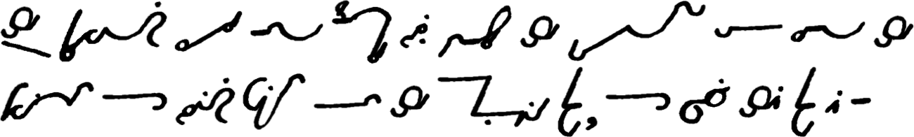
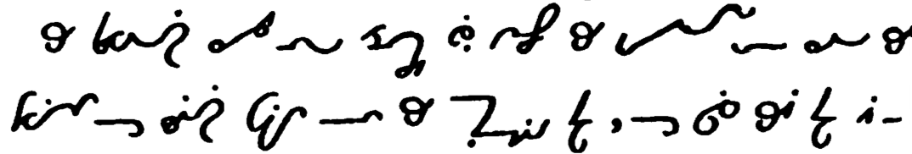

# text2orthic: Orthic Shorthand Translator

## Overview
This project translates English text into [Orthic shorthand](https://orthic.shorthand.fun/). It uses Python to convert each English word into a sequence of Orthic glyphs and render the translation as an image.

## Features
- Translate English words and sentences into Orthic shorthand
- Render translations using a collection of glyphs created by [Hugh L. Callendar and Jeremy W. Sherman](https://orthic.shorthand.fun/manual#the-cursive-alphabet)
- Easily expandable glyph set to add abbreviations, diphthongs, and other linguistic elements by simply adding corresponding PNGs to the resources folder
    - A few diphthongs and `-ing` are already included 

## Usage
Input the English text you wish to translate, and the software will render the corresponding Orthic shorthand as an image.

## Demonstrations
Below are images demonstrating the system's output:

- Generated Orthic Shorthand:
  

- Handwritten Orthic Shorthand (from [here](https://orthic.shorthand.fun/manual#specimen-of-fully-written-style)):
  

Both texts correspond to "The preceding rules and examples will enable the
student to read the specimen of writing given on the opposite page, of which
this page is a" in English.

## TODOs

- Add glyphs for common punctuation 
- Add rendering of capital letter indicator
- Consider the two forms of `w` when rendering
- Improve positioning of double-letter dot (see, e.g., `bb` for failure)
- Use [Bezier curves](https://github.com/vbrg/melin) (or similar) for smoother and more realistic rendering

## Acknowledgments
The glyph images used in this project are licensed under the [Creative Commons Attribution-ShareAlike 4.0 International License (CC BY-SA 4.0)](https://creativecommons.org/licenses/by-sa/4.0/). We thank [the creators](https://orthic.shorthand.fun/manual) of these glyphs for their work.
