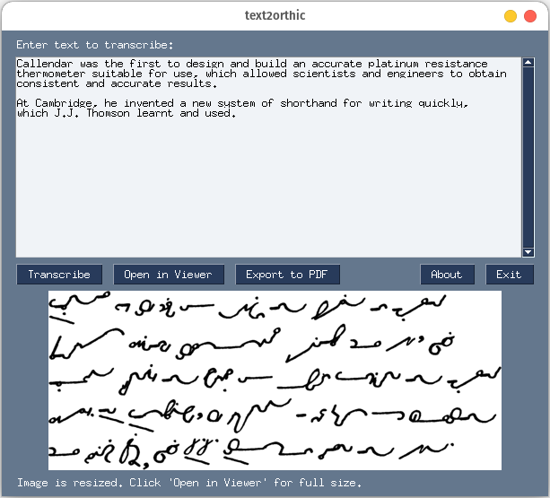

# text2orthic: Orthic Shorthand Transcriptor

This project transcribes English text into [Orthic shorthand](https://orthic.shorthand.fun/). It uses Python to convert each English word into a sequence of Orthic glyphs and render the transcription as an image.

## Motivation
While there is existing reading material for Orthic shorthand, such as [the Book of Psalms](https://orthic.shorthand.fun/assets/reading/Orthic%20Psalms%201-20%20(Full%20Style)%201896%20Stevens.pdf) or [the New Testament](https://cdm15457.contentdm.oclc.org/digital/collection/p15457coll1/id/195/rec/1), much of it is quite dated (both of the linked transcriptions were published in 1896). This project aims to bring a fresh perspective to Orthic shorthand practice by allowing users to transcribe and practice with more contemporary and personally interesting materials. Whether it's the latest news articles, modern literature, or even daily correspondence, this tool opens up new avenues for both learning and enjoying this efficient shorthand system.

## Features
- Transcribe English words and sentences into Orthic shorthand
- Render transcriptions using a [collection of glyphs](https://orthic.shorthand.fun/manual#the-cursive-alphabet) created by [Hugh L. Callendar](https://en.wikipedia.org/wiki/Hugh_Longbourne_Callendar) and [Jeremy W. Sherman](https://jeremywsherman.com/)
- Easily expandable glyph set to add abbreviations, compounds, and other linguistic elements by simply adding corresponding PNGs to the resources folder
- Export to PDF in format optimized for an e-book reader ([sample](https://raw.githubusercontent.com/rmattila/text2orthic/main/resources/demo_ebook.pdf))

## Usage
Input the English text you wish to transcribe, and the software will render the corresponding Orthic shorthand as an image.

### Adding New Glyphs
To add a new glyph, place a `.png` image in the `resources/glyphs` folder. The filename should match the glyph's representation (e.g., `ing.png` for the "ing" glyph). In the image, mark the start of the glyph's stroke with a green pixel and the end with a red pixel. The system prioritizes longer filenames, meaning if `ing.png` exists, it will be used over separate `i.png`, `n.png` and `g.png` glyphs for the "ing" combination.

## Demonstrations
Below are images demonstrating the system's output.

- Generated Orthic Shorthand:
  

- For reference, here is the same text written by a human (from [here](https://orthic.shorthand.fun/manual#specimen-of-fully-written-style)):
  

Both texts correspond to "_The preceding rules and examples will enable the
student to read the specimen of writing given on the opposite page of which
this page is a_" in English.

Here's a longer sample of (computer generated) output:

An even longer sample (17 pages) optimized for an e-book reader is available [here](https://raw.githubusercontent.com/rmattila/text2orthic/main/resources/demo_ebook.pdf). It was created using the "Export to PDF" functionality.

## TODOs

- [ ] Add more [glyphs for compounds](https://orthic.shorthand.fun/manual#how-to-write-and-join-the-characters) and overlapping joins
  - `problematic_words.txt` contains words where simple glyph concatenation leads to overlaps and readability issues
- [ ] Add more glyphs for [punctuation](https://orthic.shorthand.fun/manual#punctuation) (e.g., `()!-"` are currently missing)
  - Maybe reconsider how these are parsed and loaded (so as to avoid potentially problematic filenames like `".png`)
- [x] Add rendering of [capital letter indicator](https://orthic.shorthand.fun/manual#initial-capitals)
- [ ] Consider [the two forms](https://orthic.shorthand.fun/manual#W-join) of `w` when rendering
- [ ] Improve positioning of [double-letter dot](https://orthic.shorthand.fun/manual#doubled-letters) (see, e.g., `bb` for failure)
- [ ] Add separate folder with [ordinary style](https://orthic.shorthand.fun/manual#ordinary-style) abbreviation glyphs that can be enabled via flag (fully-written style should be the default rendering option)
- [ ] Handle and preserve paragraph breaks (from original text)
- [x] Create graphical user interface
- [ ] ~~Use [Bezier curves](https://github.com/vbrg/melin) (or similar) for smoother and more realistic rendering~~
- [ ] Add installation/how to run instructions
- [x] Implement pagination and export to PDF functionality

## Acknowledgments
The glyph images used in this project are licensed under the [Creative Commons Attribution-ShareAlike 4.0 International License (CC BY-SA 4.0)](https://creativecommons.org/licenses/by-sa/4.0/).

## Resources

- [Orthic Shorthand](https://orthic.shorthand.fun/) and [Dictionary](https://orthic.shorthand.fun/dictionary)
- [Ernest Clare, "Orhtographic Cursive Shorthand" (1915)](https://recordsearch.naa.gov.au/SearchNRetrieve/Interface/ViewImage.aspx?B=3408323)
- [r/orthic](https://old.reddit.com/r/orthic/) and [r/shorthand](https://old.reddit.com/r/shorthand/)